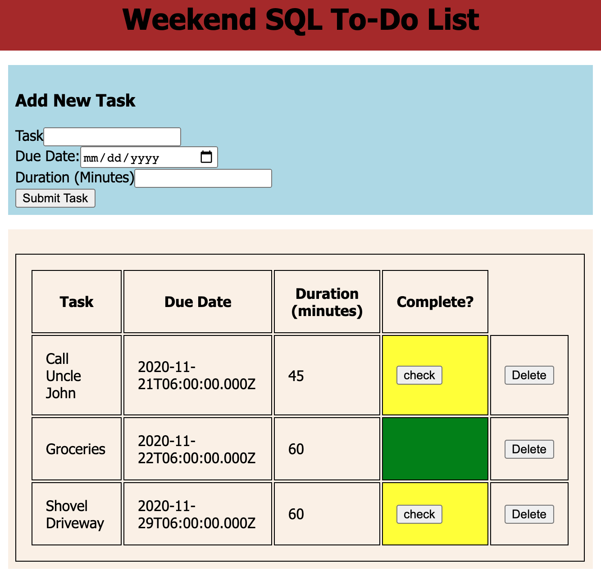

# WEEKEND SQL TO-DO LIST

## Description

_Duration: 15hrs_

My program is a to-do list. Normally, a to-do list must be maintained by a person through personal responsibility: a notebook for example, which must be saved in a drawer or in your pocket. This inherent philosophy of the traditional to-do list lends itself to loss of the to-do list itself. My to-do list lives in a database, its permanent home, and is showcased on the client, an ordinary web-browser, through the server.

### Prerequisites

- [Node.js](https://nodejs.org/en/)
- [postgresql](https://postgresql.org)

## Installation

1.Fork the public repository, https://github.com/JoelleKado/weekend-sql-to-do-list.git.
2. Clone the forked repo to your local machine.
3. Open up your downloaded repo and run the following commands in terminal:
-`npm init -y`
-`npm install`
-`npm install express`
4. Within the repository: 
-Navigate to 'database.sql'
-run the querries within the file in your SQL client to establish a database and fill it with data.

## Usage

1. Start the server:
-(In terminal) `npm start`
2. Open web browser and go to http://localhost:5000/.

3. Input task details into the input fields.

4. Press `SUBMIT` to save your new task to the database.

5. A record of all tasks are showcased on screen.

6. Press 'CHECK' to paint a task, green, for "complete".

7. Press 'DELETE' to remove a task from the Database.

## Acknowledgement
Thanks to [Prime Digital Academy](www.primeacademy.io) who equipped and helped me to make this application a reality. 
Great thanks as well to my "Pod": https://github.com/Cassen999, https://github.com/kastenbauer27, https://github.com/laramaurine; for working with me throughout this project.

## Support
If you have suggestions or issues, please email me at [jkado@my.hpu.edu](www.google.com).